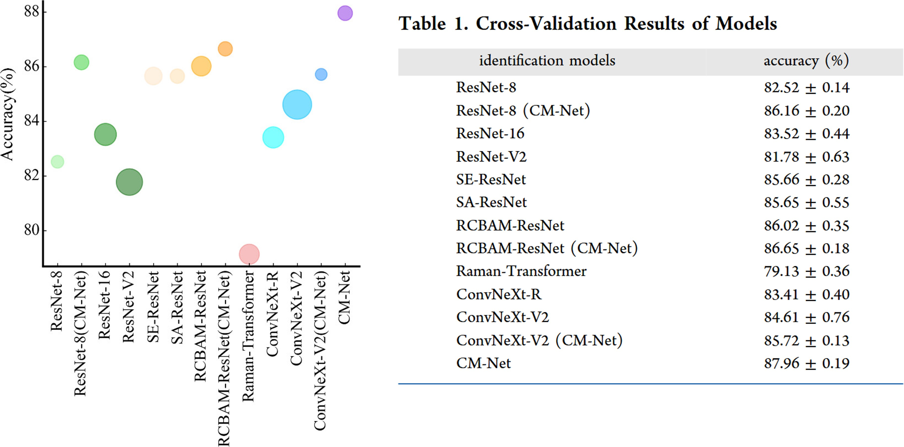
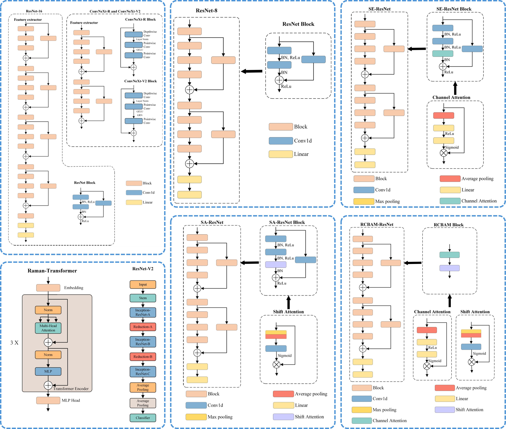
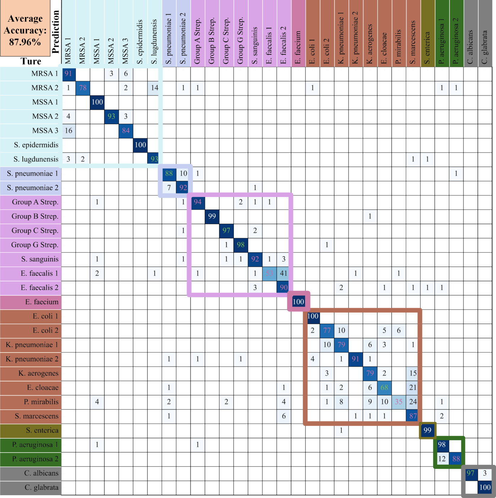

# Bacteria

## Environment

**torch == 2.0.1+cu118**
**python == 3.8.8**


## Dataset

All the data needed are available at  https://github.com/csho33/bacteria-ID.


## Training

If you want to load the pretrained model , please add "--load" in your command.

```python
python train.py --batch_size 32 --epochs 100 --device 0 --lr 0.0001 --ratio 0.9 --train_dir ./data/train --load
```


## Testing

Make sure you use the argument "--load " to load the trained model.

```python
python predict.py --batch_size 32 --device 0 --test_dir ./data/test --load 
```


## QuickStart

Run the demo.ipynb to start this project quickly.

## Ref
Chen, J., Hu, J., Xue, C. et al. Combined Mutual Learning Net for Raman Spectral Microbial Strain Identification. *Anal. Chem.* 96, 15 (2024). [https://doi.org/10.1021/acs.analchem.3c05107](https://doi.org/10.1021/acs.analchem.3c05107)


# Instruction Manual - Combined Mutual Learning Net for Raman Spectral Identification

## Manual Authors
- [Hu jiaqi] (Southern university of science and technology) (12331213@mail.sustech.edu.cn)

## Project Address
- [Web] (http://150.158.140.194:6688/)
- [GitHub](https://github.com/oilab-sustech/CM-Net)

## Contents
- [Instruction Manual - Combined Mutual Learning Net for Raman Spectral Identification](#instruction-manual---combined-mutual-learning-net-for-raman-spectral-identification)
  - [Manual Authors](#manual-authors)
  - [Project Address](#project-address)
  - [Contents](#contents)
  - [Results](#results)
  - [Preface](#preface)
  - [1、Data Preparation](#1data-preparation)
  - [2、Model Definition](#2model-definition)
  - [3、Model Pretraining](#3model-pretraining)
  - [3、Model Fine-Tuning](#3model-fine-tuning)
  - [4、Model Validation](#4model-validation)
  - [5、Model Testing](#5model-testing)

## Results

  
<div style="text-align: justify;">

## Preface
&nbsp;&nbsp;&nbsp;&nbsp; Raman spectroscopy is a non-destructive, label-free molecular fingerprinting technique widely used in chemistry, biology, materials science, and other fields. In recent years, with the advancement of technology, Raman spectroscopy has been extensively applied in disease diagnosis. During this process, deep learning models play a crucial role. In this work, we have evaluated the performance of existing models for Raman spectroscopy diagnosis and proposed a mutual learning-based Raman spectroscopy classification model to comprehensively enhance the accuracy and robustness of Raman spectroscopy diagnosis. This document primarily provides a brief introduction to the usage of this model. For detailed principles, please refer to our paper.

## 1、Data Preparation
&nbsp;&nbsp;&nbsp;&nbsp; Raman spectroscopy is one-dimensional data, typically consisting of two dimensions: wavenumber and intensity. Therefore, it does not require a two-dimensional model for processing in practical applications. Due to differences in resolution and response characteristics across different spectrometers, it is generally challenging to train models across instruments. In this work, to generalize the model, we interpolated all data to 2048 points and performed min-max normalization. The processed data can be downloaded from [github](https://github.com/oilab-sustech/CM-Net/tree/main/data), and the open-source raw data can be downloaded from [Bacteria-ID](https://github.com/csho33/bacteria-ID). Additionally, we found that preprocessing can effectively increase accuracy. However, it is important to note that if all spectra are preprocessed, noise should be added during the training phase, but it is unnecessary during the validation or testing phases. The preprocessing algorithm can be referenced from our other work: [https://doi.org/10.1038/s41377-024-01394-5](https://doi.org/10.1038/s41377-024-01394-5)。
```python
class PointsFolder(Dataset):
    
    def __init__(self, data, label, transform=None) -> None:
        super(PointsFolder, self).__init__()

        self.data = data
        self.label = label

        self.transform = transform


    def __getitem__(self, index):

        if self.data is not None:
            sample = self.data[index]
            target = self.label[index]
        else:
            raise ValueError(
            "The data cannot be None."
            )

        if self.transform is not None:
            sample = self.transform(sample)

        return sample, target
        
    def __len__(self):
        return self.data.shape[0]


data = torch.load(join(args.train_dir,'train_data.pt'))
label = torch.load(join(args.train_dir,'train_label.pt'))
load_dataset = dataset.PointsFolder(data,label)

train_len=int(len(data)*args.ratio)
val_len=int(len(data)-train_len)
train_dataset,val_dataset = random_split(dataset=load_dataset,
                                        lengths=[train_len,val_len],
                                        generator=torch.Generator().manual_seed(1))

train_loader = DataLoader(train_dataset,batch_size=args.batch_size,shuffle=True)
val_loader   = DataLoader(val_dataset,batch_size=args.batch_size,shuffle=True)
```
## 2、Model Definition
&nbsp;&nbsp;&nbsp;&nbsp; The overall diagrams of all model structures in this work are shown below and can be found on [github](https://github.com/oilab-sustech/CM-Net/tree/main/Model). Various optimizers can be used; based on our experiments, Adam is the optimal choice. Additionally, hyperparameters such as learning rate significantly impact the final accuracy during training. We recommend using our parameters or conducting an automatic search.

```python
[RCBAM_model, ResNet_model, ConvNext_V2_model] = model
args.criterion = nn.CrossEntropyLoss()
args.DML_criterion = loss.DistillationLoss(0.25)

args.optimizer_RCBAM = torch.optim.Adam(RCBAM_model.parameters(), 
                                        lr=0.000138, 
                                        weight_decay=0.00001, 
                                        betas=(0.5, 0.99))
args.schduler_RCBAM = torch.optim.lr_scheduler.StepLR(args.optimizer_RCBAM, 
                                                    step_size=10, 
                                                    gamma=0.1)
args.optimizer_ResNet = torch.optim.Adam(ResNet_model.parameters(), 
                                        lr=0.0002, 
                                        weight_decay=0.00001, 
                                        betas=(0.5, 0.99))
args.schduler_ResNet = torch.optim.lr_scheduler.StepLR(args.optimizer_ResNet, 
                                                        step_size=10, 
                                                        gamma=0.1)
args.optimizer_ConvNext_V2 = torch.optim.Adam(ConvNext_V2_model.parameters(), 
                                                lr=0.00008, 
                                                weight_decay=0.00001, 
                                                betas=(0.5, 0.99))
args.schduler_ConvNext_V2 = torch.optim.lr_scheduler.StepLR(args.optimizer_ConvNext_V2, 
                                                            step_size=10, 
                                                            gamma=0.1)

```

&nbsp;&nbsp;&nbsp;&nbsp; 下面是损失函数的定义：
```python
class DistillationLoss: 
    def __init__(self, alpha): 
        self.student_loss = nn.CrossEntropyLoss() 
        self.distillation_loss = nn.KLDivLoss() 
        self.temperature = 1
        self.alpha = alpha

    def __call__(self, student_logits, student_target_loss, teacher_logits): 
        student_logits = F.softmax(student_logits, dim=1)
        teacher_logits = F.softmax(teacher_logits, dim=1)
        distillation_loss = self.distillation_loss(F.log_softmax(student_logits / self.temperature, dim=1), 
                                                   F.softmax(teacher_logits / self.temperature, dim=1)) 

        loss = (1 - self.alpha) * student_target_loss + self.alpha * distillation_loss 
        return loss
```

## 3、Model Pretraining
&nbsp;&nbsp;&nbsp;&nbsp; To enhance the generalization ability of the model, we employed a pretraining method. The pretraining dataset can be downloaded from [Bacteria-ID](https://github.com/csho33/bacteria-ID). It is important to note that the pretraining for mutual learning is conducted for each sub-model using conventional pretraining methods, rather than using mutual learning loss. This approach facilitates method transfer. After pretraining is completed, the parameters can be loaded using the following code:
```python
RCBAM_model.load_state_dict(torch.load(join(args.checkpoints_dir,'RCBAM.pth')))
ResNet_model.load_state_dict(torch.load(join(args.checkpoints_dir,'ResNet.pth')))
ConvNext_V2_model.load_state_dict(torch.load(join(args.checkpoints_dir,'ConvNext_V2.pth')))
```
## 3、Model Fine-Tuning
&nbsp;&nbsp;&nbsp;&nbsp; Fine-tuning refers to training the model on the actual target directly based on the pretrained model. Since the amount of data is much smaller than that of the pretraining dataset, careful adjustment of hyperparameters such as learning rate is necessary to avoid overfitting. The fine-tuning code is as follows:
```python
for epoch in range(args.epochs):
    running_loss_RCMAB = 0.0
    running_loss_ResNet = 0.0
    running_loss_ConvNext_V2 = 0.0

    running_acc_RCMAB = 0.0
    running_acc_ResNet = 0.0
    running_acc_ConvNext_V2 = 0.0

    RCBAM_model.train()
    ResNet_model.train()
    ConvNext_V2_model.train()

    for X_train, y_train in train_loader:
        X_train = X_train.to(args.device)
        y_train = y_train.to(args.device)

        X_train = X_train.to(torch.float32)
        y_train = y_train.to(torch.long)

        args.optimizer_RCBAM.zero_grad()
        args.optimizer_ResNet.zero_grad()
        args.optimizer_ConvNext_V2.zero_grad()

        output_RCBAM = RCBAM_model(X_train)
        output_ResNet = ResNet_model(X_train)
        output_ConvNext_V2 = ConvNext_V2_model(X_train)

        loss_RCBAM_cla = args.criterion(output_RCBAM, y_train)
        loss_ResNet_cla = args.criterion(output_ResNet, y_train)
        loss_ConvNext_V2_cla = args.criterion(output_ConvNext_V2, y_train)
        
        loss_RCBAM = args.DML_criterion(output_RCBAM, loss_RCBAM_cla, output_ConvNext_V2) / 3
        loss_ResNet = args.DML_criterion(output_ResNet, loss_ResNet_cla, output_RCBAM) / 3
        loss_ConvNext_V2 = args.DML_criterion(output_ConvNext_V2, loss_ConvNext_V2_cla, output_RCBAM) / 3

        (loss_RCBAM).backward(retain_graph=True)
        args.optimizer_RCBAM.step()

        loss_ResNet.backward(retain_graph=True)
        args.optimizer_ResNet.step()

        loss_ConvNext_V2.backward(retain_graph=True)
        args.optimizer_ConvNext_V2.step()

        running_loss_RCMAB += loss_RCBAM.item()
        running_loss_ResNet += loss_ResNet.item()
        running_loss_ConvNext_V2 += loss_ConvNext_V2.item()

        _, pred_RCBAM = torch.max(output_RCBAM.data, 1)
        _, pred_ResNet = torch.max(output_ResNet.data, 1)
        _, pred_ConvNext_V2 = torch.max(output_ConvNext_V2.data, 1)

        running_acc_RCMAB += (pred_RCBAM == y_train).sum().item()
        running_acc_ResNet += (pred_ResNet == y_train).sum().item()
        running_acc_ConvNext_V2 += (pred_ConvNext_V2 == y_train).sum().item()

    args.schduler_RCBAM.step()
    args.schduler_ResNet.step()
    args.schduler_ConvNext_V2.step()
    acc_max_model_RCBAM,acc_max_model_ResNet,acc_max_model_ConvNext_V2=evaluate(args,
                                                                                model,
                                                                                epoch,
                                                                                val_loader,
                                                                                val_dataset)
```
## 4、Model Validation
&nbsp;&nbsp;&nbsp;&nbsp; Model validation aims to select the optimal hyperparameters and train the most suitable model. During this process, cross-validation is typically used to ensure the model's generalization ability. Additionally, the division of the validation set and the training set is crucial. Generally, the validation set should constitute between 10% and 30% of the data; if it is too large, the training set becomes too small, and if it is too small, the validation set may not be comprehensive enough. The validation code is as follows:
```python
def evaluate(args,model,epoch,test_loader,test_dataset):
    [RCBAM_model, ResNet_model, ConvNext_V2_model] = model
    
    RCBAM_model.eval()
    ResNet_model.eval()
    ConvNext_V2_model.eval()
    testing_correct_RCBAM = 0
    testing_correct_ResNet = 0
    testing_correct_ConvNext_V2 = 0
    testing_correct_sum = 0
    for X_test, y_test in test_loader:

        X_test = X_test.to(args.device)
        y_test = y_test.to(args.device)

        X_test = X_test.to(torch.float32)
        y_test = y_test.to(torch.long)

        with torch.no_grad():
            output_RCBAM = RCBAM_model(X_test)
            output_ResNet = ResNet_model(X_test)
            output_ConvNext_V2 = ConvNext_V2_model(X_test)

        out = (output_RCBAM + output_ResNet + output_ConvNext_V2) / 3

        _, pred_RCBAM = torch.max(output_RCBAM.data, 1)
        _, pred_ResNet = torch.max(output_ResNet.data, 1)
        _, pred_ConvNext_V2 = torch.max(output_ConvNext_V2.data, 1)
        _, pred = torch.max(out.data, 1)

        testing_correct_RCBAM += (pred_RCBAM == y_test).sum().item()
        testing_correct_ResNet += (pred_ResNet == y_test).sum().item()
        testing_correct_ConvNext_V2 += (pred_ConvNext_V2 == y_test).sum().item()
        testing_correct_sum += (pred == y_test).sum().item()
        

    acc_RCBAM = testing_correct_RCBAM / len(test_dataset)
    acc_ResNet = testing_correct_ResNet / len(test_dataset)
    acc_ConvNext_V2 = testing_correct_ConvNext_V2 / len(test_dataset)
    acc = testing_correct_sum / len(test_dataset)
    
    print('Epoch [%d/%d], Acc_RCBAM: %.4f, Acc_ResNet: %.4f, Acc_ConvNext_V2: %.4f, Acc: %.4f'
            % (epoch + 1, args.epochs, acc_RCBAM, acc_ResNet, acc_ConvNext_V2, acc))
    
    global max_acc_val_RCBAM,max_acc_val_ResNet,max_acc_val_ConvNext_V2
    global acc_max_model_RCBAM,acc_max_model_ResNet,acc_max_model_ConvNext_V2
    if acc_RCBAM > max_acc_val_RCBAM:
        max_acc_val_RCBAM = acc_RCBAM
        acc_max_model_RCBAM = copy.deepcopy(RCBAM_model)
    
    if acc_ResNet > max_acc_val_ResNet:
        max_acc_val_ResNet = acc_ResNet
        acc_max_model_ResNet = copy.deepcopy(ResNet_model)
    
    if acc_ConvNext_V2 > max_acc_val_ConvNext_V2:
        max_acc_val_ConvNext_V2 = acc_ConvNext_V2
        acc_max_model_ConvNext_V2 = copy.deepcopy(ConvNext_V2_model)
        
    return acc_max_model_RCBAM,acc_max_model_ResNet,acc_max_model_ConvNext_V2
```
## 5、Model Testing
&nbsp;&nbsp;&nbsp;&nbsp; After completing all the steps above, we can proceed to test the model on an independent test set. It is important to note that if the test set is not independent, the accuracy in this part may be very high.
```python
def infer(args,model):
    [RCBAM_model, ResNet_model, ConvNext_V2_model] = model
    
    RCBAM_model.eval()
    ResNet_model.eval()
    ConvNext_V2_model.eval()
    testing_correct_RCBAM = 0
    testing_correct_ResNet = 0
    testing_correct_ConvNext_V2 = 0
    testing_correct_sum = 0
    
    if args.load:
        RCBAM_model.load_state_dict(torch.load(join(args.checkpoints_dir,'RCBAM.pth')))
        ResNet_model.load_state_dict(torch.load(join(args.checkpoints_dir,'ResNet.pth')))
        ConvNext_V2_model.load_state_dict(torch.load(join(args.checkpoints_dir,'ConvNext_V2.pth')))
    
    RCBAM_model.to(args.device)
    ResNet_model.to(args.device)
    ConvNext_V2_model.to(args.device)
    
    data = torch.load(join(args.test_dir,'test_data.pt'))
    label = torch.load(join(args.test_dir,'test_label.pt'))
    test_dataset = dataset.PointsFolder(data,label)
    test_loader = DataLoader(test_dataset,batch_size=args.batch_size,shuffle=True)
    
    for X_test, y_test in tqdm(test_loader):

        X_test = X_test.to(args.device)
        y_test = y_test.to(args.device)

        X_test = X_test.to(torch.float32)
        y_test = y_test.to(torch.long)

        with torch.no_grad():
            output_RCBAM = RCBAM_model(X_test)
            output_ResNet = ResNet_model(X_test)
            output_ConvNext_V2 = ConvNext_V2_model(X_test)

        out = (output_RCBAM + output_ResNet + output_ConvNext_V2) / 3

        _, pred_RCBAM = torch.max(output_RCBAM.data, 1)
        _, pred_ResNet = torch.max(output_ResNet.data, 1)
        _, pred_ConvNext_V2 = torch.max(output_ConvNext_V2.data, 1)
        _, pred = torch.max(out.data, 1)

        testing_correct_RCBAM += (pred_RCBAM == y_test).sum().item()
        testing_correct_ResNet += (pred_ResNet == y_test).sum().item()
        testing_correct_ConvNext_V2 += (pred_ConvNext_V2 == y_test).sum().item()
        testing_correct_sum += (pred == y_test).sum().item()
        
    acc_RCBAM = testing_correct_RCBAM / len(test_dataset)
    acc_ResNet = testing_correct_ResNet / len(test_dataset)
    acc_ConvNext_V2 = testing_correct_ConvNext_V2 / len(test_dataset)
    acc = testing_correct_sum / len(test_dataset)
    
    print('Testing: Acc_RCBAM: %.4f, Acc_ResNet: %.4f, Acc_ConvNext_V2: %.4f, Acc: %.4f'
    % (acc_RCBAM, acc_ResNet, acc_ConvNext_V2, acc))
```


